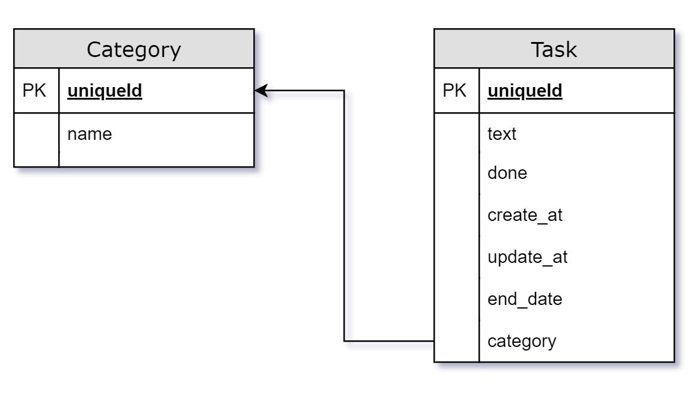

# Masonite TODO
Откройте терминал и перейдите в каталог, в котором вы хотите создать свое приложение. 
Вы можете создать его в каталоге **todo**, например:
```
mkdir todo
cd todo
```
Если вы работаете в Windows, вы можете просто создать каталог и открыть его в Powershell.

Хотя этот шаг необязателен, он настоятельно рекомендуется. Вы можете создать виртуальное окружение, 
если не хотите устанавливать все зависимости masonite. 

Создайте своё виртуальное окружение, выполнив:
```
python -m venv venv
source venv/bin/activate
```

Если вы используете Windows:
```
python -m venv venv
./venv/Scripts/activate
```

## Установка
Сначала установите Masonite:
```
pip install masonite
```
Затем создайте новый проект:
```
project start .
```
Затем установите зависимости Masonite:
```
project install
```
После установки вы можете запустить сервер разработки:
```
python craft serve
```
Перейдя по адресу `http://127.0.0.1:8000/` увидите приветственную страницу Masonite.

Чтобы выключить сервер разработки, нажмите комбинацию клавиш ++ctrl+c++

## Структура проекта - ДОРАБОТАТЬ

**app** - основная директория проекта, где вы пишите свою логику.

**/controllers** - это место, где вы обрабатываете запрос и возвращаете ответы, которые видите в 
веб-браузере. Ответы могут быть словарями, списками, html (view) или любым классом, который может 
отображать ответ.

**/middleware -** (промежуточное программное обеспечение) является чрезвычайно важным аспектом 
веб-приложений, поскольку оно позволяет запускать важный код до или после каждого запроса или 
определенных маршрутов.

**/models** - это самый простой способ взаимодействия с вашими таблицами. Модель используем для 
запроса данных в таблице или для создания новых записей, извлечения связанных записей между 
таблицами и т.д.

**/providers** - это ключевые строительные блоки для Masonite. Единственное, что они делают, 
регистрируют вещи в Service Container или запускают логику по запросам.

**config** - различные настройки проекта.

**/providers.py** содержит список всех Service Providers, участвующих в создании фреймворка.

**databases** - миграции и загрузка демо данных (seed)

**resources** - статические файлы, например такие как js и css.

**routes** - ваши юрл.

**storage** - билд ваших файлов фронтенда.

## Начало

### Routes
Рассмотрим файл `routes/web.py`.
```py hl_lines="4" linenums="1" title="routes/web.py"
from masonite.routes import Route


ROUTES = [
    Route.get("/", "WelcomeController@show")
]
```
ROUTES - это список содержит ваши юрл.

```py hl_lines="5" linenums="1" title="routes/web.py" 
from masonite.routes import Route


ROUTES = [
    Route.get("/", "WelcomeController@show")
]
```

Здесь у класса `Route` указываем какой (http) метод мы используем. Затем передаем сам путь и в текстовом 
варианте название класса контроллера и метод который нужно вызвать.

Подробнее о routes можно посмотреть в [документации](https://masonite.pro/basics/routing/).

### Controller
В директории `app/controllers` откройте файл `WelcomeController.py`
```py hl_lines="6" linenums="1" title="app/controllers/WelcomeController.py" 
"""A WelcomeController Module."""
from masonite.views import View
from masonite.controllers import Controller


class WelcomeController(Controller):
"""WelcomeController Controller Class."""

    def show(*self*, view: View):
        return view.render("welcome")
```
Наш класс контроллера должен наследоваться от класса `Controller`.

В самом классе мы описываем методы, которые будут вызываться по определенным url.

Метод `show` принимает `view` - это класс который рендерить шаблоны. 

```py hl_lines="9 10" linenums="1" title="app/controllers/WelcomeController.py" 
"""A WelcomeController Module."""
from masonite.views import View
from masonite.controllers import Controller


class WelcomeController(Controller):
"""WelcomeController Controller Class."""

    def show(*self*, view: View):
        return view.render("welcome")
```

Данный метод вернет готовый html. В метод `.render()` мы передаем название html файла.
Сам шаблон находиться в директории `templates/welcome.html`.

### Чистим
Удалим файл `WelcomeController.py`.

Из списка `ROUTES` в `routes/web.py` удалите `Route.get("/", "WelcomeController@show")`.

```py hl_lines="5" linenums="1" title="routes/web.py" 
from masonite.routes import Route


ROUTES = [

]
```

## Архитектура базы данных
Нам потребуется две таблицы для категории и задачи.



В таблице категории (Category) будет два столбца:

- **id** - идентификатор записи.
- **name** - это название категории, тип char.

В таблице задачи (Task) следующие столбцы:

- **id** - идентификатор записи.
- **text** - текст задачи, тип char.
- **done** - выполнена задача или нет, тип boolean.
- **created_at** - дата и время создания, тип datetime.
- **updated_at** - дата и время обновления, тип datetime.
- **end_date** - дата и время окончания задачи, тип datetime.
- **category** - к какой категории относиться задача, тип int unsigned.

## Настройка базы данных
Для работы нам понадобится база данных. По умолчанию Masonite использует SQLite. Если вы хотите 
использовать другую базу данных, вы можете изменить параметры, которые начинаются с **DB_** 
в файле `.env`. 
Для запуска MySQL или Postgres вам нужно будет настроить эти базы данных.
``` title=".env"
DB_CONNECTION=sqlite
DB_HOST=127.0.0.1
DB_USERNAME=root
DB_PASSWORD=root
DB_DATABASE=masonite
DB_PORT=3306
DB_LOG=True
```
## Создание миграций
Теперь можем создать миграции.

Миграции используются для создания и изменения таблиц базы данных. Это делается с помощью файлов 
миграции и класса `Schema`. Файлы миграции на самом деле являются просто оболочками для класса `Schema`, 
а также способом для Masonite управлять тем, какие миграции были запущены, а какие нет.

!!! note "Именование таблиц"
    Название таблиц мы должны указывать во **множественном** числе.

### Миграция для категорий
Для создания файла миграций выполните команду:
```
python craft migration create_categories_table --create categories
```
Рассмотрим эту команду подробнее. 

- **migration** - команда создание файла миграций.
- **create_categories_table** - часть названия файла миграции.
- **--create** - этот флаг указывает что мы создаем новую таблицу.
- **categories** - название таблицы.

Откройте файл `databases/migration/20YY_MM_DD_ABCDE_create_categories_table.py`

- **20YY_MM_DD_ABCDE** - это дата и номер которые сгенерировались автоматически.

```py hl_lines="7 11 16" linenums="1" title="databases/migration/20YY_MM_DD_ABCDE_create_categories_table.py" 
"""CreateCategoriesTable Migration."""

from masoniteorm.migrations import Migration


class CreateCategoriesTable(Migration):
    def up(self):
        """
        Run the migrations.
        """
        with self.schema.create("categories") as table:
            table.increments("id")
            
            table.timestamps()

    def down(self):
        """
        Revert the migrations.
        """
        self.schema.drop("categories")
```
В методе `up()` внутри оператора `with` мы описываем таблицу. Метод `down()` служит для отмены миграции.

- **table.increments("id")** - описывает столбец `id`. Целое число, не допускающее значение NULL, с 
автоинкрементом.
- **table.timestamps()** - создает столбцы `created_at` и `updated_at` в таблице и по умолчанию использует 
текущее время.

Добавим столбец `name` для нашей категории.

```py hl_lines="13" linenums="1" title="databases/migration/20YY_MM_DD_ABCDE_create_categories_table.py" 
"""CreateCategoriesTable Migration."""

from masoniteorm.migrations import Migration


class CreateCategoriesTable(Migration):
    def up(self):
        """
        Run the migrations.
        """
        with self.schema.create("categories") as table:
            table.increments("id")
            table.char("name")
            table.timestamps()

    def down(self):
        """
        Revert the migrations.
        """
        self.schema.drop("categories")
```

!!! note ""
    Все доступные методы можно посмотреть в документации 
    [Masonite ORM](https://orm.masoniteproject.com/schema-and-migrations#available-methods)

### Миграция для задач
Теперь создадим файл миграций для таблицы `Task`:
```
python craft migration create_tasks_table --create tasks
```
В файле `databases/migration/20YY_MM_DD_ABCDE_create_tasks_table.py` напишем следующий код:

```py hl_lines="13-17" linenums="1" title="databases/migration/20YY_MM_DD_ABCDE_create_tasks_table.py" 
"""CreateTasksTable Migration."""

from masoniteorm.migrations import Migration


class CreateTasksTable(Migration):
    def up(self):
        """
        Run the migrations.
        """
        with self.schema.create("tasks") as table:
            table.increments("id")
            table.char("text")
            table.boolean("done")
            table.datetime("end_date")
            table.integer("category_id").unsigned()
            table.foreign("category_id").references("id").on("categories").on_delete("cascade")
            table.timestamps()

    def down(self):
        """
        Revert the migrations.
        """
        self.schema.drop("tasks")
```

Поясню строки 16 и 17:

- **.unsigned()** - задает столбцу целочисленное представление, без знака.
- **.foreign("category_id")** - внешний ключ, название столбца во нашей таблице.
- **.references("id")** - столбец во внешней таблице, на который будет ссылаться локальный столбец.
- **.on("categories")** - внешняя таблица, на которую будет ссылаться локальный столбец.
- **.on_delete("cascade")** - поведение при записи из внешней таблицы, в нашем случае каскадное удаление.

### Применение миграций
Для применения миграций, т.е. создание таблиц в базе данных, выполните команду:

```
python craft migrate
```

В директории с проектом должен появиться файл `masonite.sqlite3`. По умолчанию Masonite настроен на 
использование sqlite3.

## Создание моделей
Модели в Masonite немного отличаются от других фреймворков Python. Masonite использует 
Active Record ORM. Модели и миграции в разделены. Наши модели будут повторять вид наших таблиц 
независимо от того, как выглядит таблица.

Для создания модели категории выполним следующую команду:
```
python craft model Category
```

!!! note "Именование моделей"
    Обратите внимание, что мы использовали имя модели в **единственном** числе. По умолчанию Masonite ORM 
    проверяет имя класса во множественном числе в нашей базе данных (в данном случае categories), 
    предполагая, что имя таблицы во множественном числе имени модели. 

Созданная модель теперь находится внутри `app/models/Category.py`.
```py linenums="1" title="app/models/Category.py"
""" Category Model """

from masoniteorm.models import Model


class Category(Model):
    """Category Model"""
    pass
```

Как говорилось ранее, нам не нужно манипулировать моделью. Модель будет принимать форму таблицы по 
мере того, как мы будем создавать или изменять миграции.

!!! note "Имя таблицы"
    Опять же, имя таблицы, к которой привязана модель, является формой имени модели во множественном 
    числе, но если вы назвали свою таблицу по другому, например, `task_categories` вместо `categories`, 
    мы можем явно указать имя таблицы:

    ```py linenums="1" hl_lines="8" title="app/models/Category.py"
    """ Category Model """
    
    from masoniteorm.models import Model
    
    
    class Category(Model):
        """Category Model"""
        __table__ = "task_categories"
    ```

### Разрешение на изменение данных
В моделях мы можем указать какие конкретно поля мы хотим предоставить для изменения. Таким образом, 
мы можем передать имена столбцов в методы `create()` и `update()`.

### Модель Category
Добавим атрибут `__fillable__`.
```py linenums="1" hl_lines="8" title="app/models/Category.py"
""" Category Model """

from masoniteorm.models import Model


class Category(Model):
    """Category Model"""
    __fillable__ = ["name"]
```

### Модель Task
Теперь создадим модель Task выполнив команду:
```
python craft model Task
```
Созданная модель находится `app/models/Task.py`.

В `__fillable__` перечисляем название столбцов.
```py linenums="1" hl_lines="9" title="app/models/Task.py"
""" Task Model """

from masoniteorm.models import Model
from masoniteorm.relationships import belongs_to


class Task(Model):
    """Task Model"""
    __fillable__ = ["text", "done", "end_date", "category_id"]
```

### Связь между моделями
Помните, что мы создали внешний ключ в нашей миграции. Мы можем создать эту связь в нашей модели 
следующим образом:
```py linenums="1" hl_lines="11-14" title="app/models/Task.py"
""" Task Model """

from masoniteorm.models import Model
from masoniteorm.relationships import belongs_to


class Task(Model):
    """Task Model"""
    __fillable__ = ["text", "done", "end_date", "category_id"]

    @belongs_to('category_id', 'id')
    def category(self):
        from app.models.Category import Category
        return Category
```

!!! note "Циклическое импорты"
    Из-за того, как Masonite делает модели, некоторые модели могут ссылаться друг на друга, поэтому 
    обычно лучше выполнять импорт внутри метода, как мы сделали выше, чтобы предотвратить любые возможности 
    циклического импорта.

- **@belongs_to('category_id', 'id')** - Первым аргументом **всегда** является имя столбца в таблице текущей модели, а вторым аргументом — 
связанное поле в другой таблице.

## Создание контроллера
Все контроллеры по умолчанию расположены в каталоге `app/controllers` и Masonite продвигает идею 
один контролер, один файл. Легко запомнить, где именно находится контроллер, потому что имя файла — 
это контроллер.

Конечно, вы можете перемещать контроллеры куда угодно, но командна craft по умолчанию поместит их в 
отдельные файлы.

В большинстве случаев, вы можете создать контроллер с помощью команды craft:
```
python craft controller Category
```

Команда `craft` создаст контроллер `app/controllers/CategoryController.py`, который выглядит следующим 
образом:
```py linenums="1" title="app/controllers/CategoryController.py"
from masonite.controllers import Controller
from masonite.views import View

from app.models.Category import Category


class CategoryController(Controller):
    def show(self, view: View):
        return view.render("")
```
Вы можете заметить, что в контроллере уже есть один метод, `show()`. Данный метод мы рассмотрим позже.

## Создание категорий
Добавим метод `store()`, он будет использоваться для создания категорий:
```py linenums="1" hl_lines="2 3 6 13-15" title="app/controllers/CategoryController.py"
from masonite.controllers import Controller
from masonite.request import Request
from masonite.response import Response
from masonite.views import View

from app.models.Category import Category


class CategoryController(Controller):
    def show(self, view: View):
        return view.render("")

    def store(self, request: Request, response: Response):
        Category.create(name=request.input("name"))
        return response.redirect('/')
```

!!! note warning "Бизнес логика"
    Я считаю, что бизнес логика НЕ должна находиться внутри контроллера и должна быть вынесена в 
    отдельный сервис.
    Но для упрощения примера и ознакомления с фреймворком Masonite, логику напишем в контроллере.

!!! note "Service Container"
    Обратите внимание, что мы сейчас использовали request: Request и response: Response. 
    Это объекты Request и Response. В этом сила и красота Masonite, и ваше первое знакомство с 
    Service Container. Service Container — чрезвычайно мощная реализация, позволяющая запросить у 
    Masonite объект (в данном случае Request или Response) и получить этот объект. Это называется 
    «внедрением зависимостей», важная концепция для понимания, поэтому обязательно прочитайте 
    документацию (тут вставить ссылку).

С помощью метода `create()` модели `Category` создадим категорию. В `create()` передаем название столбца и 
данные которые хотим записать. 

Для получения данных из запроса используем метод `input()`.
Masonite не обращает внимание на методы запроса, поэтому для получения данных по запросу `GET`, `POST` 
и т.д. мы используем метод `.input()`.

### Валидация
В данный момент мы не проверяем пришедшие данные. Добавим валидацию.
```py linenums="1" hl_lines="17-19" title="app/controllers/CategoryController.py"
from masonite.controllers import Controller
from masonite.request import Request
from masonite.response import Response
from masonite.views import View

from app.models.Category import Category


class CategoryController(Controller):
    def show(self, view: View):
        return view.render("")

    def create(self, view: View):
        return view.render("category.create")

    def store(self, request: Request, response: Response):
        errors = request.validate({"name": "required"})
        if errors:
            return response.back()
            
        Category.create(name=request.input("name"))
        return response.redirect('/')
```
На 17-ой строке указываем, что `name` обязателен. Более подробно про валидацию можете прочитать в
[документации](https://docs.masoniteproject.com/features/validation).

Далее если у нас есть ошибки, пользователь будет перенаправлен на страницу с которой был отправлен запрос.

## View
Добавим еще один метод `.create()`, данный метод будет рендерить шаблон добавления категории:
```py linenums="1" hl_lines="13-14" title="app/controllers/CategoryController.py"
from masonite.controllers import Controller
from masonite.request import Request
from masonite.response import Response
from masonite.views import View

from app.models.Category import Category


class CategoryController(Controller):
    def show(self, view: View):
        return view.render("")

    def create(self, view: View):
        return view.render("category.create")

    def store(self, request: Request, response: Response):
        errors = request.validate({"name": "required"})
        if errors:
            return response.back()
            
        Category.create(name=request.input("name"))
        return response.redirect('/')
```
Обратите внимание, что здесь мы "типизируем" класс `View`. Это то, что Masonite называет "внедрением 
зависимостей". 

В метод `.render()` передаем путь к шаблону через точку.

## Добавление routes
В файле `routes/web.py` добавим два url.
```py linenums="1" hl_lines="5 6" title="routes/web.py"
from masonite.routes import Route


ROUTES = [
    Route.get("/create", "CategoryController@create"),
    Route.post("/create", "CategoryController@store"),
]
```
При `get` запросе будет вызван метод контроллера `create()` и отобразит страницу.

При `post` запросе будет вызван метод контроллера `store()`, с отправленными данными формы.

## Создание html шаблона

Теперь в директории `templates` создадим директорию `category`, а в ней файл `create.html.`

В файл `templates/category/create.html` добавим следующий код:
```html linenums="1" title="templates/category/create.html"
<!DOCTYPE html>
<html lang="en">
<head>
  <meta charset="UTF-8">
  <link href="/static/style.css" rel="stylesheet">
  <title>Title</title>
</head>
<body>
<section>
    <h2>Создать категорию</h2>
    
    <form action="/create" method="POST">
        {{ csrf_field }}
        <input type="text" name="name">
        <button type="submit">Создать</button>
    </form>
</section>
</body>
</html>
```

Обратите внимание, здесь есть тег `{{ csrf_field }}` под тегом `<form>`. Masonite поставляется с 
защитой от CSRF, поэтому нам нужен токен для отображения скрытого поля с CSRF токеном.

```html linenums="1" hl_lines="5" title="templates/category/create.html"
<!DOCTYPE html>
<html lang="en">
<head>
  <meta charset="UTF-8">
  <link href="/static/style.css" rel="stylesheet">
  <title>Title</title>
</head>
<body>
<section>
    <h2>Создать категорию</h2>
    
    <form action="/create" method="POST">
        {{ csrf_field }}
        <input type="text" name="name">
        <button type="submit">Создать</button>
    </form>
</section>
</body>
</html>
```
Здесь указываем ссылку на файл стилей, ниже мы его создадим.

### Статические файлы

Создадим файл `style.css` в директории `storage/static/` и добавим в него следующий код.
```css linenums="1" title="storage/static/style.css"
section {
    width: 500px;
    margin: 0 auto;
}

h2 {
    text-align: center;
}

a {
    text-decoration: none;
}

ul li {
    list-style: none;
    position: relative;
    margin: 10px 0 2px 25px;
    padding: 3px 0 2px 25px;
    box-shadow: 1px 2px 4px grey;
    left: 0;
}

ul li::before {
    content: '*';
    position: absolute;
    top: 6px;
    left: 5px;
}
```

## Запуск сервера разработки
Выполним команду для запуска сервера разработки:
```
python craft serve
```
И перейдите по адресу `http://localhost:8000/create`

Вы увидите форму, после отправки которой вас перенаправит на `http://localhost:8000/`

## Чтение, редактирование и удаление категорий
Теперь выведем список категорий которые мы создаем. Также сделаю, чтобы можно было 
редактировать и удалять категорию.

### Список категорий

#### Контроллер
В файле `app/controllers/CategoryController.py` добавим следующий код:
```py linenums="1" hl_lines="10-12" title="app/controllers/CategoryController.py"
from masonite.controllers import Controller
from masonite.request import Request
from masonite.response import Response
from masonite.views import View

from app.models.Category import Category


class CategoryController(Controller):
    def index(self, view: View):
        categories = Category.all()
        return view.render('category.list', {'categories': categories})
    
    def show(self, view: View):
        return view.render("")

    def create(self, view: View):
        return view.render("category.create")

    def store(self, request: Request, response: Response):
        errors = request.validate({"name": "required"})
        if errors:
            return response.back()
            
        Category.create(name=request.input("name"))
        return response.redirect('/')
```
Здесь мы получаем все категории из БД. Затем указываем какой шаблон рендерить и передаем контекст в 
виде словаря. По ключу словаря будем обращаться к данным в самом шаблоне.

#### Routes
В файле `routes/web.py` добавим url для вывода списка категорий.
```py linenums="1" hl_lines="5" title="routes/web.py"
from masonite.routes import Route


ROUTES = [
    Route.get("/", "CategoryController@index"),
    Route.get("/create", "CategoryController@create"),
    Route.post("/create", "CategoryController@store"),
]
```

#### Шаблон html
В директории `templates/category` создадим файл `list.html`.

```html linenums="1" title="templates/category/list.html"
<!DOCTYPE html>
<html lang="en">
<head>
  <meta charset="UTF-8">
  <link href="/static/style.css" rel="stylesheet">
  <title>Категории</title>
</head>
<body>

<section>
  <h2>Список категорий</h2>

  <ul class="list">
    @for category in categories
    <li class="list-item">
      {{category.name}}
    </li>
    @endfor
  </ul>
</section>

</body>
</html>
```

!!! note success ""
    Masonite использует шаблоны `Jinja2`, поэтому, если вы не понимаете этот шаблон, обязательно 
    ознакомьтесь с [документацией](https://jinja.palletsprojects.com/en/3.0.x/).

```html linenums="1" hl_lines="14 16 18" title="templates/category/list.html"
<!DOCTYPE html>
<html lang="en">
<head>
  <meta charset="UTF-8">
  <link href="/static/style.css" rel="stylesheet">
  <title>Категории</title>
</head>
<body>

<section>
  <h2>Список категорий</h2>

  <ul class="list">
    @for category in categories
    <li class="list-item">
      {{category.name}}
    </li>
    @endfor
  </ul>
</section>

</body>
</html>
```

Здесь с помощью шаблонизатора, описываем цикл `for`. Который переберет все переданные категории. 
В фигурных скобках указываем объект категории и через точку обращаемся к атрибуту (столбцу таблицы) 
`name`.

### Одна категория, редактирование и удаление
Теперь реализуем возможность просматривать одну категорию, чтобы иметь возможность 
редактировать её и удалять.

#### Контроллер одной категории
```py linenums="1" hl_lines="14-16" title="app/controllers/CategoryController.py"
from masonite.controllers import Controller
from masonite.request import Request
from masonite.response import Response
from masonite.views import View

from app.models.Category import Category


class CategoryController(Controller):
    def index(self, view: View):
        categories = Category.all()
        return view.render('category.list', {'categories': categories})

    def show(self, view: View, request: Request):
        category = Category.find_or_fail(request.param("id"))
        return view.render('category.single', {'category': category})

    def create(self, view: View):
        return view.render("category.create")

    def store(self, request: Request, response: Response):
        errors = request.validate({"name": "required"})
        if errors:
            return response.back()
            
        Category.create(name=request.input("name"))
        return response.redirect('/')
```

В метод `show()` добавил получение request. 
Затем ищем категорию по `id`, который будет передаваться в url, например, `/single/2`. Здесь `2` и 
есть наш `id`. Если такая категория не будет найдена, мы увидим ошибку 404. Если вы не хотите получать
эту ошибку, можете вызвать метод `find()` у модели.

Затем мы указываем какой шаблон будем использовать и передаем в контекст объект категории.

#### Route одной категории
```py linenums="1" hl_lines="8" title="routes/web.py"
from masonite.routes import Route


ROUTES = [
    Route.get("/", "CategoryController@index"),
    Route.get("/create", "CategoryController@create"),
    Route.post("/create", "CategoryController@store"),
    Route.get("/single/@id", "CategoryController@show").name("category_single"),
]

```
Здесь в url указан параметр `id`. Чтобы указать параметр, его нужно прикрепить к символу `@`.

Также я указал имя маршрута, оно используется для получения информации о маршруте в других частях 
проекта. Имя более статично, чем URL-адрес.

#### Шаблон одной категории
В директории `templates/category` создадим файл `single.html`.

```html linenums="1" hl_lines="13 15" title="templates/category/single.html"
<!DOCTYPE html>
<html lang="en">
<head>
  <meta charset="UTF-8">
  <link href="/static/style.css" rel="stylesheet">
  <title>Редактирование категории</title>
</head>
<body>

<section>
  <h2>Редактирование категории</h2>

  <form action="/update/{{category.id}}" method="POST">
    {{ csrf_field }}
    <input type="text" name="name" value="{{category.name}}">
    <p>
      <button type="submit">Сохранить</button>
    </p>
  </form>

</section>
</body>
</html>
```

В `action` указал url по которому будет идти отправка формы, контролер и маршрут напишем позже.

В `value` тега `input` передаю значение имени категории. Таким образом форма будет заполнена.

### Контроллер обновления категории
```py linenums="1" hl_lines="34" title="app/controllers/CategoryController.py"
from masonite.controllers import Controller
from masonite.request import Request
from masonite.response import Response
from masonite.views import View

from app.models.Category import Category


class CategoryController(Controller):
    def index(self, view: View):
        categories = Category.all()
        return view.render('category.list', {'categories': categories})

    def show(self, view: View, request: Request):
        category = Category.find_or_fail(request.param("id"))
        return view.render('category.single', {'category': category})

    def create(self, view: View):
        return view.render("category.create")

    def store(self, request: Request, response: Response):
        errors = request.validate({"name": "required"})
        if errors:
            return response.back()
            
        Category.create(name=request.input("name"))
        return response.redirect('/')
        
    def update(self, request: Request, response: Response):
        category = Category.find_or_fail(request.param("id"))

        errors = request.validate({"name": "required"})
        if errors:
            return response.redirect(name='category_single', params={"id": request.param("id")})

        category.name = request.input('name')
        category.save()
        return response.redirect('/')
```

Если `name` будет отсутствовать, то пользователь будет перенаправлен на ту же страницу.
Я здесь не использую `back()`, для того чтобы показать как работать с `redirect()`.
Указываем имя маршрута и в параметрах виде словаря передаем `id` категории.

```py linenums="1" hl_lines="30 36 37" title="app/controllers/CategoryController.py"
from masonite.controllers import Controller
from masonite.request import Request
from masonite.response import Response
from masonite.views import View

from app.models.Category import Category


class CategoryController(Controller):
    def index(self, view: View):
        categories = Category.all()
        return view.render('category.list', {'categories': categories})

    def show(self, view: View, request: Request):
        category = Category.find_or_fail(request.param("id"))
        return view.render('category.single', {'category': category})

    def create(self, view: View):
        return view.render("category.create")

    def store(self, request: Request, response: Response):
        errors = request.validate({"name": "required"})
        if errors:
            return response.back()
            
        Category.create(name=request.input("name"))
        return response.redirect('/')
        
    def update(self, request: Request, response: Response):
        category = Category.find_or_fail(request.param("id"))

        errors = request.validate({"name": "required"})
        if errors:
            return response.redirect(name='category_single', params={"id": request.param("id")})

        category.name = request.input('name')
        category.save()
        return response.redirect('/')
```
После получения объекта категории, атрибуту `name` присваиваем полученное значение от 
пользователя и сохраняем.

#### Route обновления категории
```py linenums="1" hl_lines="9" title="routes/web.py"
from masonite.routes import Route


ROUTES = [
    Route.get("/", "CategoryController@index"),
    Route.get("/create", "CategoryController@create"),
    Route.post("/create", "CategoryController@store"),
    Route.get("/single/@id", "CategoryController@show").name("category_single"),
    Route.post("/update/@id", "CategoryController@update").name("category_update"),
]
```
Для обновления категории добавляем новый маршрут и указываем метод контроллера `update()`. 
Здесь используем метод `post`.

#### Запуск сервера
Теперь можно запустить сервер разработки и проверить как работает редактирование категории.
```
python craft serve
```
Если вы уже создавали категорию, то перейдите по ссылке `http://localhost:8000/single/1`.
У вас должна отобразиться форма с уже заполненными данными. 

Если из поля ввода удалить текст и сохранить, вас должно перенаправить на эту же страницу. 

Вы можете ввести валидные данные и нажать сохранить, категория измениться и вы будете перенаправлены 
на главную страницу.

#### Ссылка на редактирование
Доработаем шаблон списка категорий и укажем ссылку на страницу редактирования.

```html linenums="1" hl_lines="16" title="templates/category/list.html"
<!DOCTYPE html>
<html lang="en">
<head>
  <meta charset="UTF-8">
  <link href="/static/style.css" rel="stylesheet">
  <title>Категории</title>
</head>
<body>

<section>
  <h2>Список категорий</h2>

  <ul class="list">
    @for category in categories
    <li class="list-item">
      <a href="/single/{{category.id}}">{{category.name}}</a>
    </li>
    @endfor
  </ul>
</section>

</body>
</html>
```

### Удаление категории
Настало время реализовать удаление категории.

#### Контроллер удаления категории
В контроллер добавим метод `destroy()` для удаления категории.
```py linenums="1" hl_lines="40-43" title="app/controllers/CategoryController.py"
from masonite.controllers import Controller
from masonite.request import Request
from masonite.response import Response
from masonite.views import View

from app.models.Category import Category


class CategoryController(Controller):
    def index(self, view: View):
        categories = Category.all()
        return view.render('category.list', {'categories': categories})

    def show(self, view: View, request: Request):
        category = Category.find_or_fail(request.param("id"))
        return view.render('category.single', {'category': category})

    def create(self, view: View):
        return view.render("category.create")

    def store(self, request: Request, response: Response):
        errors = request.validate({"name": "required"})
        if errors:
            return response.back()

        Category.create(name=request.input("name"))
        return response.redirect('/')

    def update(self, request: Request, response: Response):
        category = Category.find_or_fail(request.param("id"))

        errors = request.validate({"name": "required"})
        if errors:
            return response.redirect(name='category_single', params={"id": request.param("id")})

        category.name = request.input('name')
        category.save()
        return response.redirect('/')

    def destroy(self, request: Request, response: Response):
        post = Category.find_or_fail(request.param("id"))
        post.delete()
        return response.redirect('/')
```
Здесь ищем категорию и если она существует, то удаляем. Для этого используем метод `delete()`.

#### Маршрут удаления категории
```py linenums="1" hl_lines="10" title="routes/web.py"
from masonite.routes import Route


ROUTES = [
    Route.get("/", "CategoryController@index"),
    Route.get("/create", "CategoryController@create"),
    Route.post("/create", "CategoryController@store"),
    Route.get("/single/@id", "CategoryController@show").name("category_single"),
    Route.post("/update/@id", "CategoryController@update").name("category_update"),
    Route.get("/delete/@id", "CategoryController@destroy"),
]
```
Добавляю еще один url для удаления категории. Также будем передавать `id` той категории которую хотим
удалить. Для удаления будем использовать http метод `get`.

#### Шаблон удаления категории
В шаблоне `templates/category/single.html` добавим ссылку на удаление.

```html linenums="1" hl_lines="21" title="templates/category/single.html"
<!DOCTYPE html>
<html lang="en">
<head>
  <meta charset="UTF-8">
  <link href="/static/style.css" rel="stylesheet">
  <title>Редактирование категории</title>
</head>
<body>

<section>
  <h2>Редактирование категории</h2>

  <form action="/update/{{category.id}}" method="POST">
    {{ csrf_field }}
    <input type="text" name="name" value="{{category.name}}">
    <p>
      <button type="submit">Сохранить</button>
    </p>
  </form>
  
  <a href="/delete/{{category.id}}">Удалить</a>

</section>
</body>
</html>
```
Просто добавляем ссылку на url удаления категории и подставляем id категории.

После нажатия по ссылке, категория должна удалиться и вы будете перенаправлены на главную страницу.

#### Ссылка на создание категории
Доработаем шаблон списка категорий `templates/category/single.html` и добавим ссылку на страницу создания категории.

```html linenums="1" hl_lines="13" title="templates/category/list.html"
<!DOCTYPE html>
<html lang="en">
<head>
  <meta charset="UTF-8">
  <link href="/static/style.css" rel="stylesheet">
  <title>Категории</title>
</head>
<body>

<section>
  <h2>Список категорий</h2>
  
  <a href="{{ route('category_create') }}">Создать категорию</a>

  <ul class="list">
    @for category in categories
    <li class="list-item">
      <a href="/single/{{category.id}}">{{category.name}}</a>
    </li>
    @endfor
  </ul>
</section>

</body>
</html>
```

Тут я также добавил просто ссылку, но для построения url использовал `route()`.
В данный метод передаем имя маршрута в виде строки.

Чтобы данную ссылку Masonite смог построить, нужно добавить `name` нашему маршруту создания категории.
```py linenums="1" hl_lines="6" title="routes/web.py"
from masonite.routes import Route


ROUTES = [
    Route.get("/", "CategoryController@index"),
    Route.get("/create", "CategoryController@create").name('category_create'),
    Route.post("/create", "CategoryController@store"),
    Route.get("/single/@id", "CategoryController@show").name("category_single"),
    Route.post("/update/@id", "CategoryController@update").name("category_update"),
    Route.get("/delete/@id", "CategoryController@destroy"),
]
```

Теперь можете запустить сервер и проверить как это работает. 

У вас на главной странице должен выводиться список категорий. Вверху быть ссылка на создание категории.
При переходе на одну из категорий, у вас должна быть возможность ее отредактировать или удалить.

## Задачи (Task)
Для начала нам нужно создать контроллер для задач. Создадим контроллер сразу с нужными методами, для
этого нужно использовать флаг `-r`.

Выполните команду:
```
python craft controller Task -r
```

### Контроллер задач
Откройте файл `app/controllers/TaskController.py`.

```py linenums="1" title="app/controllers/TaskController.py"
from masonite.controllers import Controller
from masonite.views import View


class TaskController(Controller):
    def index(self, view: View):
        return view.render("")

    def create(self, view: View):
        return view.render("")

    def store(self, view: View):
        return view.render("")

    def show(self, view: View):
        return view.render("")

    def edit(self, view: View):
        return view.render("")

    def update(self, view: View):
        return view.render("")

    def destroy(self, view: View):
        return view.render("")
```
#### Импорт

Сразу добавим нужные нам импорты. Импортируем классы `Request`, `Response` и модель `Task`.
```py linenums="1" hl_lines="2 3 6"  title="app/controllers/TaskController.py"
from masonite.controllers import Controller
from masonite.request import Request
from masonite.response import Response
from masonite.views import View

from app.models.Task import Task


class TaskController(Controller):
    ...
```

Перед тем как писать логику в контроллере добавим маршруты в `ROUTES`.

### Маршруты для задач
Группы маршрутов — отличный способ сгруппировать вместе несколько маршрутов с одинаковыми параметрами, 
такими как префикс или с одним и тем же middleware. 
```py linenums="1" hl_lines="11-23" title="routes/web.py"
from masonite.routes import Route

ROUTES = [
    Route.get("/", "CategoryController@index"),
    Route.get("/create", "CategoryController@create").name('category_create'),
    Route.post("/create", "CategoryController@store"),
    Route.get("/single/@id", "CategoryController@show").name("category_single"),
    Route.post("/update/@id", "CategoryController@update").name("category_update"),
    Route.get("/delete/@id", "CategoryController@destroy"),

    Route.group(
        [
            Route.get("/", "TaskController@index").name("list"),
            Route.get("/create", "TaskController@create").name("create"),
            Route.post("/create", "TaskController@store").name("store"),
            Route.get("/single/@id", "TaskController@show").name("single"),
            Route.post("/update/@id", "TaskController@update").name("update"),
            Route.get("/delete/@id", "TaskController@destroy").name("delete"),
            Route.post("/edit/@id", "TaskController@edit").name("done"),
        ],
        prefix="/task",
        name="task."
    )
]
```
Для этого мы используем метод `group()`, который принимает список маршрутов и параметры.

В приведенном выше коде, имена маршрутов будут `task.list`, `task.create` и т.д. За это отвечает параметр
`name`.

URL-адрес будет виде `/task`, `/task/create `и т.д. За это отвечает параметр
`prefix`.

Более подробно о группах маршрутов можно посмотреть в 
[документации](https://masonite.pro/basics/routing/).

!!! note warning "Параметр name"
    Обратите внимание, если вы указали параметр `name`, то вам обязательно нужно для каждого маршрута
    в группе указать имя в методе `name()`.
    **Иначе вы получите ошибку.**
