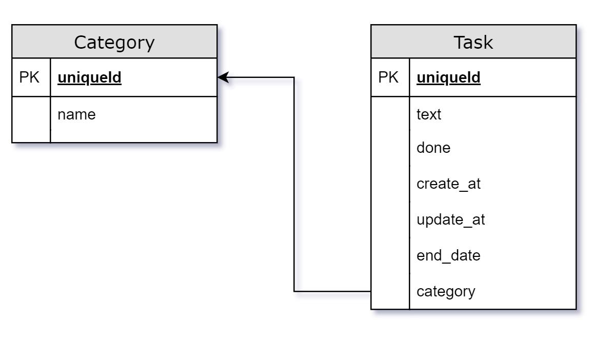

# Работа с базой данных в Masonite
Нам потребуется две таблицы для категории и задачи.



В таблице категории (Category) будет два столбца:

- **id** - идентификатор записи.
- **name** - это название категории, тип char.

В таблице задачи (Task) следующие столбцы:

- **id** - идентификатор записи.
- **text** - текст задачи, тип char.
- **done** - выполнена задача или нет, тип boolean.
- **created_at** - дата и время создания, тип datetime.
- **updated_at** - дата и время обновления, тип datetime.
- **end_date** - дата и время окончания задачи, тип datetime.
- **category** - к какой категории относиться задача, тип int unsigned.

## Настройка базы данных
Для работы нам понадобится база данных. По умолчанию Masonite использует SQLite. Если вы хотите 
использовать другую базу данных, вы можете изменить параметры, которые начинаются с **DB_** 
в файле `.env`. 
Для запуска MySQL или Postgres вам нужно будет настроить эти базы данных.
``` title=".env"
DB_CONNECTION=sqlite
DB_HOST=127.0.0.1
DB_USERNAME=root
DB_PASSWORD=root
DB_DATABASE=masonite
DB_PORT=3306
DB_LOG=True
```
## Создание миграций
Теперь можем создать миграции.

Миграции используются для создания и изменения таблиц базы данных. Это делается с помощью файлов 
миграции и класса `Schema`. Файлы миграции на самом деле являются просто оболочками для класса `Schema`, 
а также способом для Masonite управлять тем, какие миграции были запущены, а какие нет.

!!! note "Именование таблиц"
    Название таблиц мы должны указывать во **множественном** числе.

### Миграция для категорий
Для создания файла миграций выполните команду:
```
python craft migration create_categories_table --create categories
```
Рассмотрим эту команду подробнее. 

- **migration** - команда создание файла миграций.
- **create_categories_table** - часть названия файла миграции.
- **--create** - этот флаг указывает что мы создаем новую таблицу.
- **categories** - название таблицы.

Откройте файл `databases/migration/20YY_MM_DD_ABCDE_create_categories_table.py`

- **20YY_MM_DD_ABCDE** - это дата и номер которые сгенерировались автоматически.

```py hl_lines="7 11 16" linenums="1" title="databases/migration/20YY_MM_DD_ABCDE_create_categories_table.py" 
"""CreateCategoriesTable Migration."""

from masoniteorm.migrations import Migration


class CreateCategoriesTable(Migration):
    def up(self):
        """
        Run the migrations.
        """
        with self.schema.create("categories") as table:
            table.increments("id")
            
            table.timestamps()

    def down(self):
        """
        Revert the migrations.
        """
        self.schema.drop("categories")
```
В методе `up()` внутри оператора `with` мы описываем таблицу. Метод `down()` служит для отмены миграции.

- **table.increments("id")** - описывает столбец `id`. Целое число, не допускающее значение NULL, с 
автоинкрементом.
- **table.timestamps()** - создает столбцы `created_at` и `updated_at` в таблице и по умолчанию использует 
текущее время.

Добавим столбец `name` для нашей категории.

```py hl_lines="13" linenums="1" title="databases/migration/20YY_MM_DD_ABCDE_create_categories_table.py" 
"""CreateCategoriesTable Migration."""

from masoniteorm.migrations import Migration


class CreateCategoriesTable(Migration):
    def up(self):
        """
        Run the migrations.
        """
        with self.schema.create("categories") as table:
            table.increments("id")
            table.char("name")
            table.timestamps()

    def down(self):
        """
        Revert the migrations.
        """
        self.schema.drop("categories")
```
Для того чтобы указать тип данных, который может храниться в столбце используем методы `table`.
Каждый метод представляет собой нужный тип.

- **.char("name")** - тип данных char, в кавычках название столбца.

!!! note ""
    Все доступные методы можно посмотреть в документации 
    [Masonite ORM](https://orm.masoniteproject.com/schema-and-migrations#available-methods)

### Миграция для задач
Теперь создадим файл миграций для таблицы `Task`:
```
python craft migration create_tasks_table --create tasks
```
В файле `databases/migration/20YY_MM_DD_ABCDE_create_tasks_table.py` напишем следующий код:

```py hl_lines="13-17" linenums="1" title="databases/migration/20YY_MM_DD_ABCDE_create_tasks_table.py" 
"""CreateTasksTable Migration."""

from masoniteorm.migrations import Migration


class CreateTasksTable(Migration):
    def up(self):
        """
        Run the migrations.
        """
        with self.schema.create("tasks") as table:
            table.increments("id")
            table.char("text")
            table.boolean("done").default(False)
            table.datetime("end_date")
            table.integer("category_id").unsigned()
            table.foreign("category_id").references("id").on("categories").on_delete("cascade")
            table.timestamps()

    def down(self):
        """
        Revert the migrations.
        """
        self.schema.drop("tasks")
```

Поясню строки 14, 16 и 17:

- **.default(False)** - значение по умолчанию.
- **.unsigned()** - задает столбцу целочисленное представление, без знака.
- **.foreign("category_id")** - внешний ключ, название столбца во нашей таблице.
- **.references("id")** - столбец во внешней таблице, на который будет ссылаться локальный столбец.
- **.on("categories")** - внешняя таблица, на которую будет ссылаться локальный столбец.
- **.on_delete("cascade")** - поведение при записи из внешней таблицы, в нашем случае каскадное удаление.

### Применение миграций
Для применения миграций, т.е. создание таблиц в базе данных, выполните команду:

```
python craft migrate
```

В директории с проектом должен появиться файл `masonite.sqlite3`. По умолчанию Masonite настроен на 
использование sqlite3.

## Создание моделей
Модели в Masonite немного отличаются от других фреймворков Python. Masonite использует 
Active Record ORM. Модели и миграции в разделены. Наши модели будут повторять вид наших таблиц 
независимо от того, как выглядит таблица.

Для создания модели категории (Category) выполним следующую команду:
```
python craft model Category
```

!!! note "Именование моделей"
    Обратите внимание, что мы использовали имя модели в **единственном** числе. По умолчанию Masonite ORM 
    проверяет имя класса во множественном числе в нашей базе данных (в данном случае categories), 
    предполагая, что имя таблицы во множественном числе имени модели. 

Созданная модель теперь находится внутри `app/models/Category.py`.
```py linenums="1" title="app/models/Category.py"
""" Category Model """

from masoniteorm.models import Model


class Category(Model):
    """Category Model"""
    pass
```

Как говорилось ранее, нам не нужно манипулировать моделью. Модель будет принимать форму таблицы по 
мере того, как мы будем создавать или изменять миграции.

!!! note "Имя таблицы"
    Имя таблицы, к которой привязана модель, является формой имени модели во множественном 
    числе, но если вы назвали свою таблицу по другому, например, `task_categories` вместо `categories`, 
    мы можем явно указать имя таблицы:

    ```py linenums="1" hl_lines="8" title="app/models/Category.py"
    """ Category Model """
    
    from masoniteorm.models import Model
    
    
    class Category(Model):
        """Category Model"""
        __table__ = "task_categories"
    ```

### Разрешение на изменение данных
В моделях мы можем указать какие конкретно поля мы хотим предоставить для изменения. Таким образом, 
мы можем передать имена столбцов в методы `create()` и `update()`.

### Модель Category
Добавим атрибут `__fillable__` в класс модели `Category`.
```py linenums="1" hl_lines="8" title="app/models/Category.py"
""" Category Model """

from masoniteorm.models import Model


class Category(Model):
    """Category Model"""
    __fillable__ = ["name"]
```

### Модель Task
Теперь создадим модель `Task` выполнив команду:
```
python craft model Task
```
Созданная модель находится `app/models/Task.py`.

В `__fillable__` перечисляем название столбцов.
```py linenums="1" hl_lines="9" title="app/models/Task.py"
""" Task Model """

from masoniteorm.models import Model
from masoniteorm.relationships import belongs_to


class Task(Model):
    """Task Model"""
    __fillable__ = ["text", "done", "end_date", "category_id"]
```

### Связь между моделями
Помните, что мы создали внешний ключ в нашей миграции, для связи задач и категории. Мы можем 
описать эту связь в нашей модели следующим образом:
```py linenums="1" hl_lines="11-14" title="app/models/Task.py"
""" Task Model """

from masoniteorm.models import Model
from masoniteorm.relationships import belongs_to


class Task(Model):
    """Task Model"""
    __fillable__ = ["text", "done", "end_date", "category_id"]

    @belongs_to('category_id', 'id')
    def category(self):
        from app.models.Category import Category
        return Category
```

!!! note "Циклическое импорты"
    Из-за того, как Masonite создает модели, некоторые модели могут ссылаться друг на друга, поэтому 
    обычно лучше выполнять импорт внутри метода, как мы сделали выше, чтобы предотвратить любые возможности 
    циклического импорта.

- **@belongs_to('category_id', 'id')** - Первым аргументом **всегда** является имя столбца в таблице текущей модели, а вторым аргументом — 
связанное поле в другой таблице.

[Часть 4](/examples/todo/category/)
